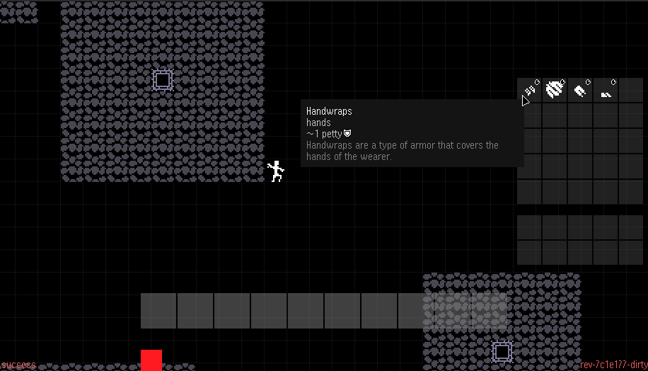

# morogue
morogue is a WIP multiplayer roguelike engine/game.



## Developing
morogue uses the [gobl](https://github.com/kettek/gobl) build system. For development, you should start both the server and the client in watch mode:

```bash
go run . watch-server
```

```bash
go run . watch-client
```

Whenever watched files are changed, either program will be re-built and then re-executed.

To see the other available *gobl* commands, just issue:

```bash
go run .
```

## Architectural Notes

  * All network communication is done through msgpack using unmarshal/marshal functionality.
    * Interfaces, such as Archetypes, Objects, Events, and Messages, employ the use of wrappers to safely marshal and unmarshal interfaces to and from their concrete types.
  * Networking uses websockets.
  * Almost every distinct object in the world is of the *Object* type and contains a reference ID to an *Archetype* (and a cached pointer to said Archetype for efficiency). An Archetype contains the actual underlying data for an object, such as damage done, slots used, title. An Object is a "live" object that is used for actual world processing and interaction.
  * Character objects are marshaled as JSON into a [bbolt](https://pkg.go.dev/go.etcd.io/bbolt#section-readme) database.
  * All Archetypes are defined as JSON files in various directories in the `archetypes` directory.
  * All Archetypes are defined and referenced by a UUIDv5 identifier. This identifier can be provided either by an ASCII string, an array of bytes, or by a human-readable string that is converted to the actual UUID. This human-readable string is written as `morogue:type:thing`, where *type* would be *armor*, *weapon*, *item*, *character*, or *tile*, and *thing* would be whatever the actual archetype is called.